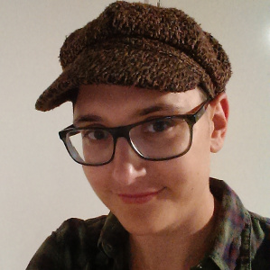

I am a German native speaker with extensive experience teaching and tutoring German one-on-one.
I grew up near Dresden where I went to school and university. I have lived in Manchester since 2006, completing an MA at the University of Manchester.

I have taught pupils at GCSE and A-Level, and adults from beginner to advanced levels. I have also worked with British undergraduate students studying German and helped them prepare for their year abroad and exams.

## Tuition

I focus on supporting an individual's abilities and what they want to achieve. I have a lot of experience working one-on-one and really tailor my tutoring to the student's needs. I can teach individuals or small groups over a longer or shorter period of time, depending on your needs.

 * You want to live abroad and/or practice German communication? Great; we'll spend our lessons predominantly talking and I'll answer any grammatical questions you may have.
 * You want to improve your school German and focus on preparing for a language test? Let's do it -- I have a lot of experience explaining grammar in an accessible way.
 * You have never learnt German before and want to give it a go? No problem; we can start from scratch and build up your language skills at your pace.
 * You need German for work? We can do that too! Simply get in touch and I'll see how I can help you.

## Translation

I offer translation from German to English and vice versa. I am very familiar with both cultural contexts and can thus work accurately and reliably.
